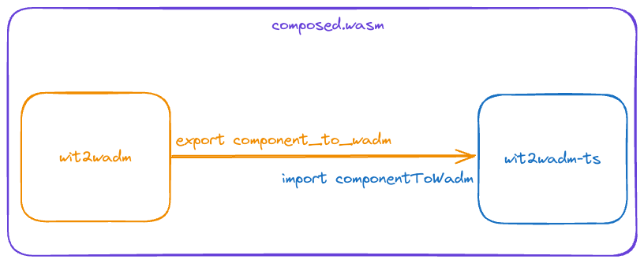
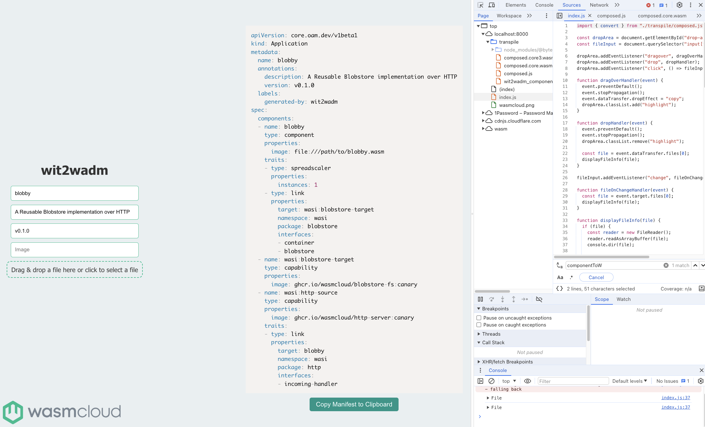

# wit2wadm TypeScript

This repository includes a Wasm component written in TypeScript that composes with the Rust component [wit2wadm](https://github.com/brooksmtownsend/wit2wadm).

This is a general demonstration of composing components together in order to reuse functionality from different languages. I wrote a small library (wit2wadm) in Rust, and because that library is also compilable to a component it can be used by any other WebAssembly component. The below [usage](#usage) section walks through how you can build this TypeScript component and compose it with my Rust wit2wadm component as if it was a native TypeScript library.

## Building

### Prerequisites

- [wasm-tools](https://github.com/bytecodealliance/wasm-tools/tree/main)
- [jco](https://github.com/bytecodealliance/jco)
- [wash](https://wasmcloud.com/docs/installation)
- [node](https://docs.npmjs.com/downloading-and-installing-node-js-and-npm)
- [rust](https://www.rust-lang.org/tools/install)

Install Node dependencies and build the component:

```bash
# Install NPM dependencies
npm install
# Build the TypeScript component
wash build
# Build the wit2wadm component
wash build -p ./wit2wadm
```

Let's take a look at the two component's WIT interfaces:

```bash
➜ wash inspect --wit ./wit2wadm/build/wit2wadm_component_s.wasm

package root:component;

world root {
  import wasi:cli/environment@0.2.0;
  import wasi:cli/exit@0.2.0;
  import wasi:io/error@0.2.0;
  import wasi:io/streams@0.2.0;
  import wasi:cli/stdin@0.2.0;
  import wasi:cli/stdout@0.2.0;
  import wasi:cli/stderr@0.2.0;
  import wasi:clocks/wall-clock@0.2.0;
  import wasi:filesystem/types@0.2.0;
  import wasi:filesystem/preopens@0.2.0;
  import wasi:random/random@0.2.0;

  export wasmcloud:tools/convert;
}
```

```bash
➜ wash inspect --wit ./build/wit2wadm_ts_s.wasm

package root:component;

world root {
  import wasmcloud:tools/convert;

  export wasmcloud:tools/convert;
}
```

What we're going to be doing by composing these components together is connecting the `export wasmcloud:tools/convert` in the Rust component to the `import wasmcloud:tools/component` in the TypeScript component, and the final product is a single WebAssembly component.



## Compose

Compose the component with the [wit2wadm](./wit2wadm/) Rust component, satisfying the `wasmcloud:tools/convert` import in our WIT:

```bash
# Copy into current directory for simplicity
cp ./wit2wadm/build/wit2wadm_component_s.wasm ./wit2wadm.wasm
# Compose the components, the wit2wadm component export will satisfy the import of the TypeScript component
wasm-tools compose ./build/wit2wadm_ts_s.wasm --definitions ./wit2wadm.wasm > composed.wasm
```

Taking a look at our composed component, we can see that we've ended up with a combination of both components:

```bash
➜ wash inspect --wit ./composed.wasm

package root:component;

world root {
  import wasi:cli/environment@0.2.0;
  import wasi:cli/exit@0.2.0;
  import wasi:io/error@0.2.0;
  import wasi:io/streams@0.2.0;
  import wasi:cli/stdin@0.2.0;
  import wasi:cli/stdout@0.2.0;
  import wasi:cli/stderr@0.2.0;
  import wasi:clocks/wall-clock@0.2.0;
  import wasi:filesystem/types@0.2.0;
  import wasi:filesystem/preopens@0.2.0;
  import wasi:random/random@0.2.0;

  export wasmcloud:tools/convert;
}
```

## Transpile and run in the web

Using `jco`, we can transpile this now composed component to run as a JavaScript module in the web.

```bash
# Transpile our composed component
jco transpile ./composed.wasm -o ./wit2wadm/docs/transpile --no-typescript
```

Currently, the wit2wadm website is configured to run the Rust component. Make one small change in the JavaScript to point at the TypeScript component instead under [./wit2wadm/docs/index.js](./wit2wadm/docs/index.js)

```js
// File: wit2wadm/docs/index.js
// Change the import path
// import { convert } from "./transpile/wit2wadm_component.js";
import { convert } from "./transpile/composed.js";
```

Now serve the site:

```bash
➜ python3 -m http.server -d wit2wadm/docs
```


